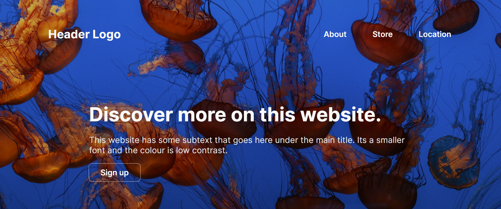

# Odin Landing Page
The Odin Project - Foundations Course Project 2:

Developing a web page using HTML/CSS based on design guidelines in outlines folder.

## Preview

## Links
Live Link: https://luciavu.github.io/odin-landing-page/

Assignment: https://www.theodinproject.com/lessons/foundations-landing-page

## Credits
Header background by Micahl Percado on Unspash https://unsplash.com/@michalp24

Image 1 and favicon by Dmitry Bukhantsov on Unsplash https://unsplash.com/@bdv91 

Image 2 by Nadine Marfurt on Unsplash https://unsplash.com/@nadine3

Image 3 by Pengxiao Xu on Unsplash https://unsplash.com/@pengxiaoxu

Image 4 by David Clode on Unsplash https://unsplash.com/@davidclode